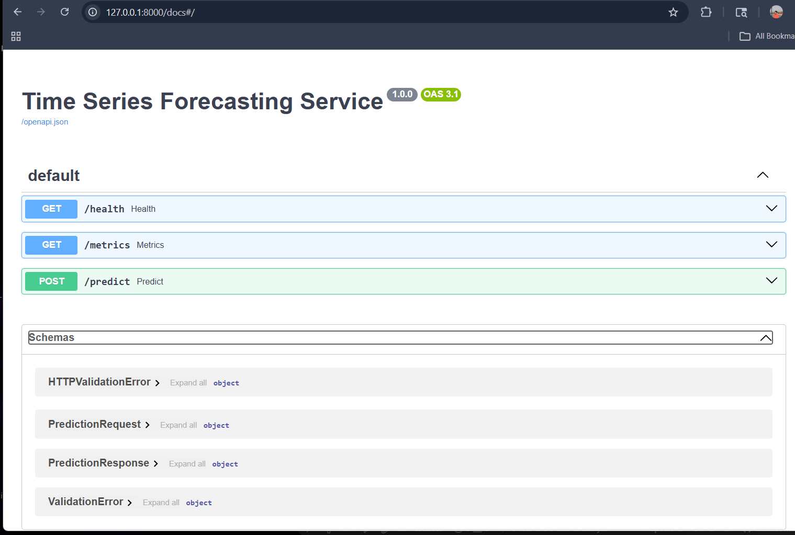
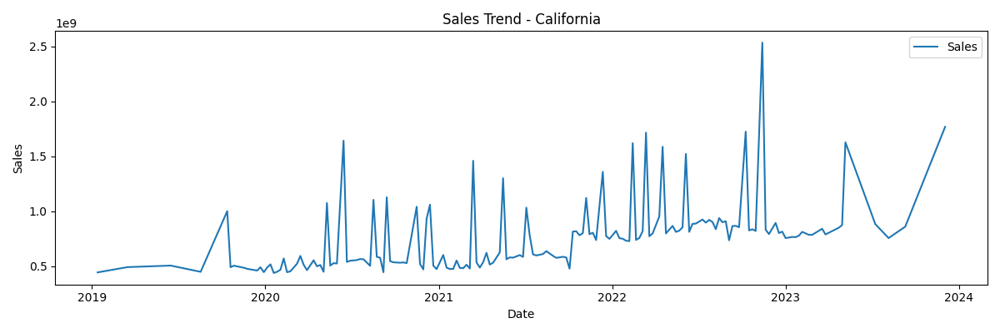
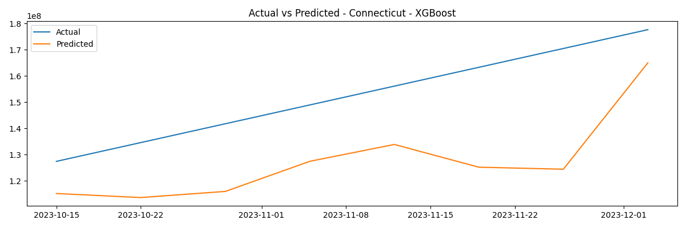
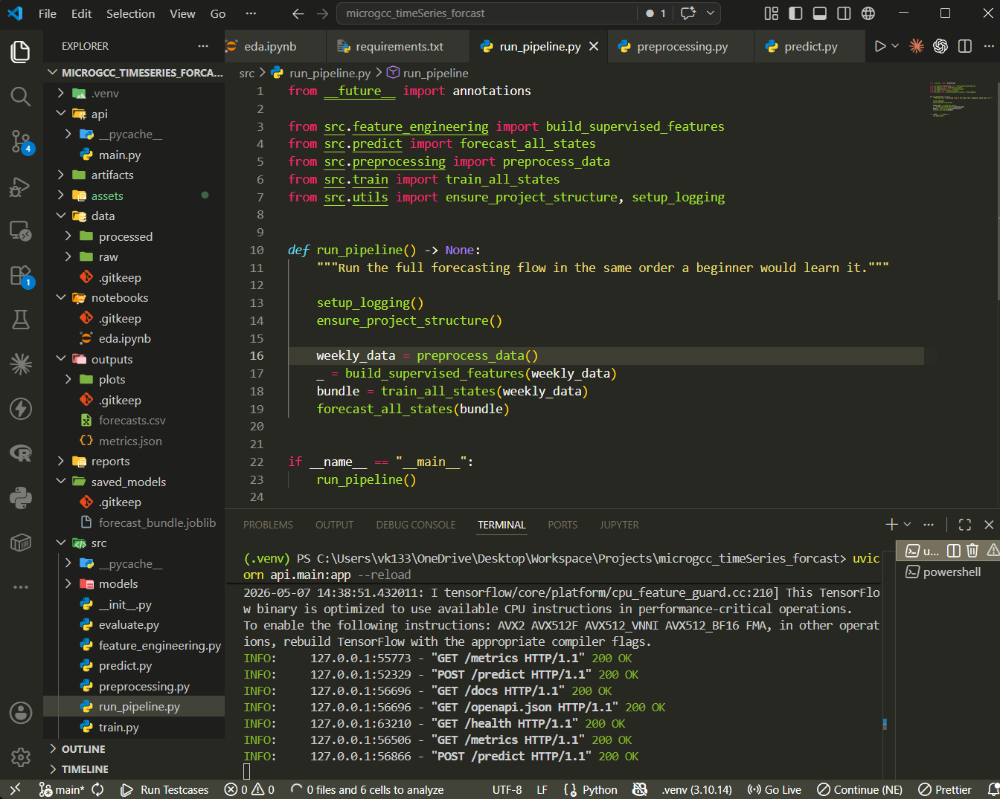

# Time Series Forecasting System with FastAPI

Production-ready end-to-end time series forecasting system that predicts the next 8 weeks of sales for each state using multiple forecasting models and exposes predictions through a REST API.

## Demo Video

[Watch the Loom walkthrough](https://www.loom.com/share/186ef8fa067c4650ae3a71975ac03d20)

<p>
  <a href="https://www.loom.com/share/186ef8fa067c4650ae3a71975ac03d20">
    
  </a>
</p>

---

# Objective

The goal of this project is to:

- Train multiple forecasting algorithms
- Compare and automatically select the best model
- Forecast future sales for each state
- Serve predictions through FastAPI
- Follow real-world backend ML architecture

---

# Dataset Schema

The dataset contains:

| Column | Description |
|---|---|
| State | State name |
| Date | Historical sales date |
| Total | Sales value |
| Category | Product category |

Example:

```csv
State,Date,Total,Category
Alabama,1/12/2019,109574036,Beverages
Arizona,1/12/2019,109101595,Beverages
```

---

# System Architecture

```text
Raw Dataset
    ↓
Preprocessing
    ↓
Feature Engineering
    ↓
Train Multiple Models
    ↓
Evaluate Models
    ↓
Best Model Selection
    ↓
Save Trained Models (.joblib)
    ↓
FastAPI REST API
    ↓
Forecast Response
```

---

# Tech Stack

- Python
- Pandas
- NumPy
- Statsmodels
- Prophet
- XGBoost
- TensorFlow / Keras
- FastAPI
- Matplotlib
- Joblib

---

# Project Structure

```text
time-series-forecasting/
|
|-- data/
|   |-- raw/
|   |   `-- Forecasting Case.csv
|   `-- processed/
|       `-- cleaned_data.csv
|
|-- notebooks/
|   `-- eda.ipynb
|
|-- src/
|   |-- preprocessing.py
|   |-- feature_engineering.py
|   |-- train.py
|   |-- evaluate.py
|   |-- predict.py
|   |-- utils.py
|   |-- run_pipeline.py
|   `-- models/
|       |-- arima_model.py
|       |-- prophet_model.py
|       |-- xgboost_model.py
|       `-- lstm_model.py
|
|-- api/
|   `-- main.py
|
|-- saved_models/
|
|-- outputs/
|   |-- forecasts.csv
|   |-- metrics.json
|   `-- plots/
|
|-- requirements.txt
|-- README.md
|-- Dockerfile
`-- .gitignore
```

---

# Forecasting Models Implemented

This project trains and compares:

1. ARIMA / SARIMA
2. Facebook Prophet
3. XGBoost
4. LSTM Neural Network

---

# Feature Engineering

The following forecasting features are created:

## Lag Features
- sales_lag_1
- sales_lag_7
- sales_lag_30

## Rolling Statistics
- rolling_mean_7
- rolling_std_7
- rolling_mean_30
- rolling_std_30

## Temporal Features
- day_of_week
- month
- quarter
- week_of_year
- is_weekend

## Holiday Features
- Indian holiday flags using `holidays` library

---

# Model Selection Strategy

Each forecasting model is trained independently for every state.

Models are compared using:

- RMSE
- MAE
- MAPE

The model with the lowest validation RMSE is automatically selected as the best forecasting model for that state.

---

# Production Design Decisions

- Models are saved using Joblib to avoid retraining during API requests.
- Weekly resampling is used for consistent forecasting intervals.
- Preprocessing is separated from training for modularity.
- FastAPI exposes lightweight prediction endpoints.
- The forecasting pipeline is organized into reusable modules.

---

# Beginner-Friendly Learning Flow

To understand the project step-by-step:

1. `src/run_pipeline.py`
2. `src/preprocessing.py`
3. `src/feature_engineering.py`
4. `src/train.py`
5. `src/evaluate.py`
6. `src/predict.py`
7. `api/main.py`

---

# Setup

## Create Virtual Environment

```bash
python -m venv .venv
```

## Activate Environment

### Windows
```bash
.venv\Scripts\activate
```

### Linux / Mac
```bash
source .venv/bin/activate
```

## Install Dependencies

```bash
pip install -r requirements.txt
```

---

# Run Full Forecasting Pipeline

```bash
python -m src.run_pipeline
```

This generates:

- processed dataset
- trained models
- evaluation metrics
- forecast CSVs
- forecast plots

---

# Outputs Generated

```text
data/processed/cleaned_data.csv
saved_models/forecast_bundle.joblib
outputs/metrics.json
outputs/forecasts.csv
outputs/plots/*.png
```

---

# Exploratory Data Analysis

Open:

```text
notebooks/eda.ipynb
```

EDA includes:
- trend analysis
- seasonality analysis
- missing value inspection
- state-wise visualization

---

# Run FastAPI Server

```bash
uvicorn api.main:app --reload
```

Swagger API documentation:

```text
http://127.0.0.1:8000/docs
```

---

# API Endpoints

## GET /health

Returns API status.

### Response

```json
{
  "status": "ok"
}
```

---

## GET /metrics

Returns:
- model comparison
- RMSE / MAE / MAPE
- state-level metrics

---

## POST /predict

Generate next 8-week sales forecast.

### Request

```json
{
  "state": "Alabama"
}
```

### Response

```json
{
  "state": "Alabama",
  "forecast": [
    236709479.5,
    233332492.6,
    231813792.7,
    346693411.1,
    355352953.1,
    233780694.8,
    223035049.7,
    276511952.5
  ]
}
```

---

# How Prediction Requests Work

```text
Client Request
      ↓
FastAPI receives request
      ↓
Load saved forecast_bundle.joblib
      ↓
Select trained model for requested state
      ↓
Generate next 8-week forecast
      ↓
Return JSON response
```

---

# Screenshots

## API Documentation



---

## Forecast Visualization



---

## Actual vs Predicted



---
## Project Structure



---

# Notes

- Mixed date formats are handled during preprocessing.
- Missing values are interpolated and forward/backward filled.
- Prophet may require CmdStan installation on Windows systems.
- Weekly forecasting is used to match the assignment requirement.

---

# Future Improvements

- Docker deployment
- Cloud deployment
- Automated retraining
- Monitoring pipeline
- Frontend dashboard
